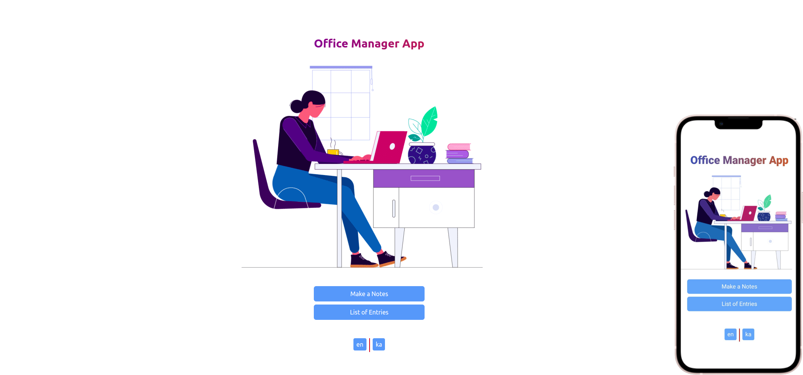

### Table of content
- [About the application](#about-the-application)
- [App Looks Like](#app-looks-like)
- [Install and Run](#install-and-run)
- [Package](#package)


## About the application
The application is intended for the office manager, it is like a support application. It helps the office manager to keep track of the employees who use the company's equipment.
The application is bilingual (English & Georgia)
## App Looks Like



## Install and Run

Install npm
```
npm install
```
Run app
```
npm start
```

## Package

| name                             | version  |
| -------------------------------- | -------- |
| i18next-browser-languagedetector | ^6.1.5   |
| i18next-http-backend             | ^1.4.1   |
| react-i18next                    | ^11.18.5 |
| react-router-dom                 | ^6.3.0   |
| tailwindcss                      | ^3.1.8   |
